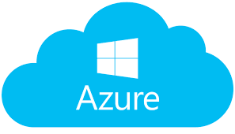

# Qt5 & Qt6 Azure Storage REST API class
    
 
## What is it

This library (with a basic example) is designed to be integrated in projects using Azure storage which can't use Azure communication libraries provided by Microsoft.

This Qt class is able to do those actions from/to a container with any kind of blob in Azure storage using an account name and an account key:
 - <b>List containers</b>
 - <b>Download file</b>
 - <b>Upload file</b>
 - <b>List files</b>
 - <b>Get user download file URL</b> (SAS credential to provide)
It is possible to use <b>marker</b> to list specific contents to not get too much content.

This class <a href="https://download.qt.io/archive/qt/">is compatible with any Qt 5 version and should be compatible with Qt6 version</a> (only required libraries: QtNetwork and QtCore)

<b>Important note: This project only support account credentials and therefore does not support SAS credentials.</b>

## How to install

1) Download this repository</a>

2) Open the <a href="https://github.com/QuentinCG/QAzureStorageRestApi/blob/master/QAzureStorageRestApi.pro">QAzureStorageRestApi.pro</a> file from <a href="https://download.qt.io/archive/qt/">QtCreator</a>.

3) Build and launch the project to see the result in the command line (the library and program example will be generated)

## License

This project is under MIT license. This means you can use it as you want (just don't delete the library header).

## Contribute

If you want to add more examples or improve the library, just create a pull request with proper commit message and right wrapping.

## Contributors

- Thank you <a target="_blank" href="https://github.com/kediger">kediger</a> for your help on updating the library to the new Azure API (2021) + Making it compatible with Qt6.
