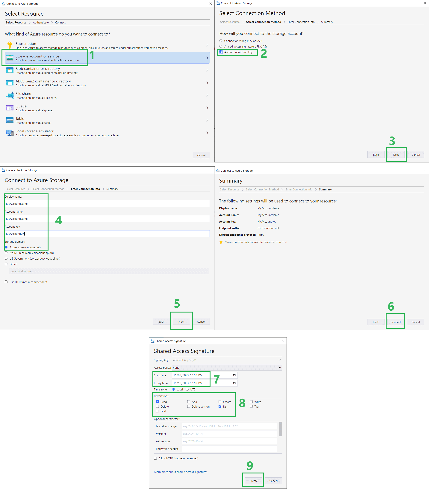

# Qt5 & Qt6 Azure Storage REST API class
[](https://codecov.io/gh/QuentinCG/QAzureStorageRestApi) [](https://www.codacy.com/manual/QuentinCG/QAzureStorageRestApi?utm_source=github.com&amp;utm_medium=referral&amp;utm_content=QuentinCG/QAzureStorageRestApi&amp;utm_campaign=Badge_Grade) [](https://github.com/QuentinCG/QAzureStorageRestApi/blob/master/LICENSE) [](https://paypal.me/QuentinCG)

## What is it

This library (with detailed examples) is designed to be integrated in projects using Azure storage.

This Qt class is able to do those actions from/to a container with any kind of blob in Azure storage using an account name and an account key or SAS credentials:
 - <b>Download file</b>
 - <b>Upload file</b>
 - <b>Delete file</b>
 - <b>Get user download file URL</b> (SAS token with read right to provide, <a href="#annex-get-sas-token">more details on how to get the SAS token here</a>)
 - <b>List containers</b> & <b>list files in a container</b> (It is possible to use <b>marker</b> to list specific contents/containers to not get too much content)

This class <a href="https://download.qt.io/archive/qt/">is compatible with any Qt 5 and any Qt6 version</a> (only required libraries: QtNetwork and QtCore, NO NEED OF OFFICIAL MICROSOFT LIBRARY)

This project <b>supports connection using `account credentials` and `SAS credentials`</b> depending on your need.

It is possible to use it <b>`synchronously` or `asynchronously (with Qt signals`)</b> depending on your need!


## How to use

Initialize:

```cpp
#include <QCoreApplication>
#include <QtNetwork>
#include <QDebug>

#include "QAzureStorageRestApi.h"

int main(int argc, char *argv[])
{
  QCoreApplication a(argc, argv);

  // Initialize connection using Storage account key
  QAzureStorageRestApi* azure = new QAzureStorageRestApi("AZURE_STORAGE_ACCOUNT_NAME_HERE", "AZURE_STORAGE_ACCOUNT_KEY_HERE", &a, true);
  // OR Initialize connection using SAS key (SAS key must grant access to Read/Add/Write/Delete/List depending on which requests you need to execute with this library)
  // QAzureStorageRestApi* azure = new QAzureStorageRestApi("AZURE_STORAGE_ACCOUNT_NAME_HERE", "AZURE_STORAGE_SAS_KEY_HERE", &a, false);

  QString containerName = "CONTAINER_NAME_HERE";
  QString fileName = "test.txt"; // You can also provide folder & subfolders like "folder1/folder2/test.txt" if you want to organize your files (folders are not related to container name)

  (...)
```

Asynchronous usage:
```cpp
  (...)

  // --- UPLOAD ---
  QNetworkReply* uploadFileReply = azure->uploadFile("C:/test.txt", containerName, fileName);
  // (Use azure->uploadFileQByteArray if you have the data in memory)
  // You can connect to the reply to be sure it is uploaded sucessfully, check example/main.cpp for full detail

  // --- DOWNLOAD FILE ---
  QNetworkReply* downloadFileReply = azure->downloadFile(containerName, fileName);
  // You can connect to the reply to be sure it is a success + get the file as QByteArray, check example/main.cpp for full detail

  // --- DELETE FILE ---
  QNetworkReply* deleteFileReply = azure->deleteFile(containerName, fileName);
  // You can connect to the reply to be sure it is deleted sucessfully, check example/main.cpp for full detail

  // --- GENERATE URL TO PROVIDE TO USER (SAS TOKEN MUST GRANT ACCESS TO READ/LIST ONLY, CHECK ANNEX OF README FOR PROCEDURE) ---
  qDebug() << "URL to provide to user to download file if SAS token provided with read access to container: '" +
              azure->generateUrl(containerName, fileName, "sv=2022-11-02&sr=b&sig=.......") +
              "'";

  // --- LIST CONTAINERS ---
  QNetworkReply* listContainersReply = azure->listContainers();
  // You can connect to the reply to be sure it is a success + get the full response to parse the containers list, check example/main.cpp for full detail
  // Then you can get clean containers list using QAzureStorageRestApi::parseContainerList

  // --- LIST FILES ---
  QNetworkReply* listFilesReply = azure->listFiles(containerName);
  // You can connect to the reply to be sure it is a success + get the full response to parse the files list, check example/main.cpp for full detail
  // Then you can get clean files list using QAzureStorageRestApi::parseFileList

  // Keep the app running until you treated all your signal/slots
  return a.exec();
}
```

Synchronous usage:
```cpp
  (...)

  // --- UPLOAD ---
  QNetworkReply::NetworkError codeSynchronous = azure->uploadFileSynchronous("C:/test.txt", containerName, fileName);
  // (Use azure->uploadFileQByteArraySynchronous if you have the data in memory)
  if (codeSynchronous == QNetworkReply::NetworkError::NoError)
  {
    qDebug() << "File uploaded with success into " + containerName + "/" + fileName;
  }
  else
  {
    qWarning() << "Error upload file in " + containerName + "/" + fileName + " (error code " + QString::number(codeSynchronous) + ")";
  }

  // --- DOWNLOAD FILE ---
  QByteArray downloadedFile;
  codeSynchronous = azure->downloadFileSynchronous(containerName, fileName, downloadedFile);
  if (codeSynchronous == QNetworkReply::NetworkError::NoError)
  {
    qDebug() << "File " + containerName + "/" + fileName + " downloaded with success";
    qDebug() << "File content : " << QString(downloadedFile);
  }
  else
  {
    qWarning() << "Error download file from " + containerName + "/" + fileName + " (error code " + QString::number(codeSynchronous) + ")";
  }

  // --- DELETE FILE ---
  codeSynchronous = azure->deleteFileSynchronous(containerName, fileName);
  if (codeSynchronous == QNetworkReply::NetworkError::NoError)
  {
    qDebug() << "File deleted with success from " + containerName + "/" + fileName;
  }
  else
  {
    qWarning() << "Error deleting file from " + containerName + "/" + fileName + " (error code " + QString::number(codeSynchronous) + ")";
  }

  // --- GENERATE URL TO PROVIDE TO USER (SAS TOKEN MUST GRANT ACCESS TO READ/LIST ONLY, CHECK ANNEX OF README FOR PROCEDURE) ---
  qDebug() << "URL to provide to user to download file if SAS token provided with read access to container: '" +
              azure->generateUrl(containerName, fileName, "sv=2022-11-02&sr=b&sig=.......") +
              "'";

  // --- LIST CONTAINERS ---
  QList< QMap<QString,QString> > foundListOfContainers;
  codeSynchronous = azure->listContainersSynchronous(foundListOfContainers);
  if (codeSynchronous == QNetworkReply::NetworkError::NoError)
  {
    qDebug() << "Received list of containers.";
    qDebug() << "List of containers:";
    for (QMap<QString,QString>& foundContainer : foundListOfContainers)
    {
      QMap<QString, QString>::iterator it;
      for (it = foundContainer.begin(); it != foundContainer.end(); ++it)
      {
        qDebug() << QString("%1 : %2").arg(it.key()).arg(it.value());
      }
    }
  }
  else
  {
    qWarning() << "Error listing containers (error code " + QString::number(codeSynchronous) + ")";
  }

  // --- LIST FILES ---
  QList< QMap<QString,QString> > foundListOfFiles;
  codeSynchronous = azure->listFilesSynchronous(containerName, foundListOfFiles);
  if (codeSynchronous == QNetworkReply::NetworkError::NoError)
  {
    qDebug() << "Received list of files in container " + containerName;
    qDebug() << "List of files in the container:";
    for (QMap<QString,QString>& file : foundListOfFiles)
    {
      QMap<QString, QString>::iterator it;
      for (it = file.begin(); it != file.end(); ++it)
      {
        qDebug() << QString("%1 : %2").arg(it.key()).arg(it.value());
      }
    }
  }
  else
  {
    qWarning() << "Error listing files in container " + containerName + " (error code " + QString::number(codeSynchronous) + ")";
  }

  // You can end the app since all was done synchronously !
}
```

Full example here: [https://github.com/QuentinCG/QAzureStorageRestApi/blob/master/example/main.cpp](https://github.com/QuentinCG/QAzureStorageRestApi/blob/master/example/main.cpp)


## How to install

1) Download this repository</a>

2) Open the <a href="https://github.com/QuentinCG/QAzureStorageRestApi/blob/master/QAzureStorageRestApi.pro">QAzureStorageRestApi.pro</a> file from <a href="https://download.qt.io/archive/qt/">QtCreator</a>.

3) Build and launch the project to see the result in the command line (the library and program example will be generated)

## License

This project is under MIT license. This means you can use it as you want (just don't delete the library header).

## Contribute

If you want to add more examples or improve the library, just create a pull request with proper commit message and right wrapping.

## Contributors

Thank you
 - <a target="_blank" href="https://github.com/kediger">kediger</a> for your help on updating the library to the new Azure API (2021) + Making it compatible with Qt6
 - <a target="_blank" href="https://github.com/fverneau">fverneau</a> for your issues to ask missing features and help on tests & annex section.


## Annex: Get SAS Token

In order to generate file download URL for end users, it is needed to have an Azure Storage `SAS Token` on container you want to make accessible.
An other SAS token can also be needed if you want to authenticate this library using `SAS` instead of `account key`.


Here is an example on how to generate this SAS signature and how to use it with the library:
 - Download & install <a target="_blank" href="https://azure.microsoft.com/en-us/products/storage/storage-explorer/">Azure Storage Explorer</a>
 - Connect to your account in the application:
   - Create a new connection to the Azure `Storage Account or service`
   - Select the method based on `Account name and key`
   - Enter your credentials
   - Press `connect`
 - Generate the SAS Token:
   - Right-click on the container name you want to give access to
   - Click on `Get Shared Access Signature`
   - You must then define the `start time` and `expiry time` date
   - You must add `permissions`
     - For Download URL: `Read` & `List` ONLY
     - For library initialization: All permissions you will need depending on how you'll use it (if need all features: `Read`/`Add`/`Write`/`Delete`/`List`)
   - Press `Create`
 - The generated SAS token can be used like this to generate any file (in the container) from the download URL using this library: `azure->generateUrl(containerName, fileName, "sv=2022-11-02&sr=b&sig=.......")`


